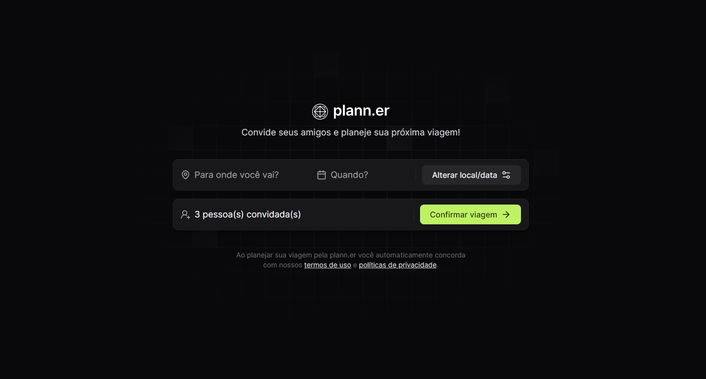
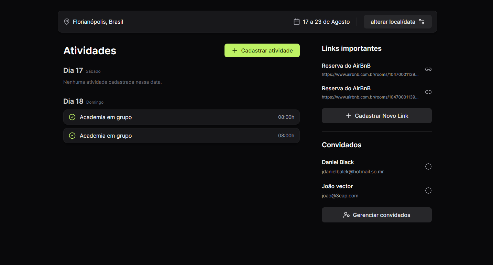

  <h1 style="color: white; text-align: center; padding-top: 40vh;">Bem-vindo ao Meu Plann.er</h1>
     
  

  
 
   

## Sobre o projeto
Este projeto é um planejador de Viagens, tecnologias que ultilizei:   
- TypeScript  
- React   
- JavaScript  
- Tailwind  
